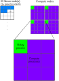

# io-server
attempt to implement a hybrid IO server for model usage

# The plan

There will be 2 types of nodes, running 3 different types of processes:

* One IO server
    - 1 or more IO processes
* Many compute nodes, each with
    - 1 relay process (between the node and the IO server)
    - Many compute processes
    

