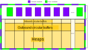
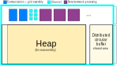

## Compute nodes

- The shared memory segment on compute nodes only contains a memory arena, from which all shared memory structures will be allocated.
- Every compute *and* relay process will have a heap (large), an inbound circular buffer (small), and an outbound circular buffer (medium)
- The in/out circular buffers allow communication between relay and compute processes for input and output operations respectively.

