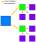
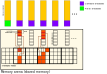
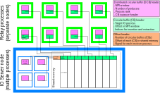
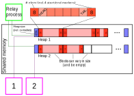
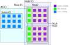

# IO server overview

## Process types

There will be 2 types of nodes, running different types of processes (PEs):

1. One or more IO server nodes, each with
    1. Multiple _data receiver_ processes (or _server-bound_ PEs)
        - Read data from buffers
        - Assemble data grids
        - Transfer commands to other PEs for processing
        - Process data + store it to disk
    2. Multiple _data sender_ processes (or _model-bound_ PEs)
        - Not implemented (or designed) yet
        - Will be responsible for reading data from disk and getting it to the compute nodes
    3. Multiple _stream processor_ processes
        - Execute commands sent by the compute nodes
        - Process assembled grid (interpolation, writing to files, etc.)
        - See [streams](Streams.md)
    4. Multiple _channel_ processes
        - Act as communication channels
        - Continuously sync buffers so that MPI communication through that process is completed
        - The buffers are accessible from other PEs
2. Many compute nodes, each with
    1. One _server-bound relay_ process
        - Sending data and commands from the compute node to the server node
    2. One _model-bound relay_ process
        - Not implemented yet
        - Will get data from the server node to the compute node
    3. Many compute (or _model_) processes
        - Do computations and produce data
        - Store data in RAM accessible to relay processes
    

## General flow of data (for outputting results to disk)

1. Computation data is exchanged directly between compute nodes/processes as the model is running (not part of this project).
2. On each node, results are first placed by every **compute process** in a space accessible by the **relay process**.
3. Results from each **relay process** are transmitted to the IO server **server-bound processes**.
4. On the server, **server-bound processes** assemble the data into a full grid. They also place commands in a command queue.
5. IO server **stream-processors** write everything into files and performs optional horizontal interpolations and other commands.

## Communication details

### Writing a grid to file

* Collective call
* Initiated by _all_ compute processes
* Each compute process provides its entry:
    * _Common metadata_ (same for all compute processes)
        * Size and position of the global grid
        * Any other data needed for the server-side processing
    * _Individual metadata_ (unique to each process)
        * Local size and location on the global grid
    * The _data_ itself. Actually, a pointer to it, to avoid an additional copy operation
    * A _tag_ is automatically added

### The transfers

In general, all data is transferred using a first in, first out (FIFO) queue,
where each queue is only used by a single sender and a single receiver.
These queues are implemented in a lockless fashion with circular buffers.
More details on that in [Implementation elements](#Implementation_elements)

* Compute processes
    * Put their entry in their individual queue, located in shared memory. The entry contains a pointer to the data. The entry could also just be a command

* Relay processes
    * Will collect data from local queues, located in shared memory
    * 1 queue for each compute process on the node
    * Data exchanged directly through shared memory
        * Written in place by the compute processes, using the memory arena component and the heap manager
    * For each queue:
        * Read the entry
        * Strip the common metadata
        * Get data from the heap.
        * Put in message buffer
    * Once all entries are collected into the message buffer, send that buffer to the server through MPI

    

* IO server processes
    * Will collect data in distributed circular buffers (stored on the server)
    * 1 buffer for each relay process
    * Data exchanged using MPI 1-sided
    
## Implementation elements
## {#Implementation_elements}

### Data structures

* **Shared memory circular buffer**
    - Allows to locally accumulate data from compute processes on their node
    - Lockless first-in first-out queue
* **Memory arena**
    - Allows to manage shared memory on an MPI node.
    - Provides the local circular buffers on compute nodes
    - Provides the memory heaps on compute nodes
* **Distributed circular buffer**
    - Allows to transfer data to/from the IO server
    - MPI flavor of shared memory sibling
* **Simple Heap Manager**
    - Allows to manage output memory blocks by the model processes (a heap would normally be a memory block from the memory arena)
    - Allows multiple processes on the server to reassemble grid data received in chunks from compute processes
* **Jar/serializer**
    - Allows to put any kind of data into it, to be retrieved as an array or pointer
    - Can gather multiple data types into a single array to be transmitted via circular buffers
* **Model file**
    - IO server interface that is exposed to the Model
    - Allows model processes to open file, write data to it and close it (through requests sent through the circular buffers)
    - _When writing, allows to specify how to process the data once on the server_
* **Server file**
    - Provides a handle to the actual file written on disk
    - _Provides a (shared) space where server processes can assemble grid data_
* **Multi-process thread pool?**
    - _Shared object that allows to "reserve" threads (CPUs) for processing data_

### Other elements

* **MPI instrumentation** (separate project)
    - The mpi-tools library intercepts every MPI calls and collects timing and data transfer statistics.

* **[[Communication protocols]]**
    - Define how information (data or commands) is exchanged between processes on a node and between nodes
      * What commands can be sent
      * How to specify what to do with each message
    - _Define how model data is structured, how it must be processed_

* **IO server structure setup** (initialization)
    - Create all needed MPI communicators
    - Allocate shared memory segments according to node type
    - Create data structures (shared or not)

* **File/output data management**
    - 1 server process can actually create/write/close each file
    - Data is received by all server processes, must be reassembled so that one process can write it
    - _Data is processed by a single process, possibly using multiple threads_
      * _**This step is complicated and needs to be discussed**_

* **Relay loop**
  1. Constantly go through circular buffers from model processes on that node
  2. Gather messages from CBs into a larger buffer
  3. If needed get data from the heap (from the pointer given in the message) and put it in the buffer
  3. _Gather other metadata (compression, processing)_
  3. When full, send the buffer to the server through the DCB

* **Server loop**
  1. Constantly go through the buffers in the DCB
  2. Gather each message and process them
    - Open files
    - _Assemble grid data_ (partially done)
    - _Process grid data_
    - Close files
  3. Check for any completed and processes set of grid data. Write them to the corresponding file

* **Model input**
    - TBD

### Circular buffer

- First-in, first-out queue to hold data. It is only made for exchanging data between **two** processes, one *producer* (sender) and one *consumer* (receiver).
- When storing it in shared memory, there is a single instance of the entire buffer, including its header (metadata).
- To add data to the queue, the producer
  - waits until there is enough free space
  - puts the data in the next available slot(s)
  - updates the *insertion* pointer of the queue
- To take data from the queue, the consumer
  - waits until there is data in the queue
  - reads the data
  - updates the *extraction* pointer of the queue
- The entire set of operations takes place without any lock
  - *Do we want the two pointers (insertion/extraction) to be on different cache lines?*
  - Only the producer modifies the insertion pointer
  - Only the consumer modifies the extraction pointer
  - Every other operation (than add/consume) only reads these pointers

### Distributed circular buffer

- Stored in a shared memory area on the IO server. Directly accessible (for data extraction) by the server processes on that node, and remotely accessible (for data insertion/extraction) through 1-sided MPI calls by the client processes. Each client process is associated with a single instance of a (remotely located) circular buffer and will only insert data into (or extract from) that one.

    

- There are server-bound buffers (for data output) and client-bound buffers (for data input).
For both types of buffers, their data content is stored on the server.
For server-bound buffers, MPI communication occurs when inserting data; for client-bound buffers, communication occurs when extracting data.
- Uses almost the same protocol to produce/consume as the local circular buffer.
However, since communication is more expensive, we want to minimize the number of MPI API calls that require synchronization.
More specifically, *only the producer will perform data transfers between the two nodes*.
This means that the consumer node will always be passive with respect to these data transfers.
- We will choose a buffer size such that the producer should not have to wait to insert anything.
If we get to a point where it does have to wait, we have other issues to deal with first.
- While the buffer set itself is only located on the consumer node, each producer holds a copy of its buffer instance header (mainly pointers to start and end of data).
- To add data, the producer:
  - Checks its local header for available space (no communication)
  - If there isn't enough space
    a. Updates its local header with the version on the consumer node (communication)
    b. Checks locally if there's enough space. If there is, all good, we can move on. Otherwise go to c.
    c. Nanosleep or something, then go back to a.
  - The previous step is basically a busy wait, which is why we need to choose a buffer size large enough to ensure that this loop never iterates more than once.
  - Puts the data
  - Updates the header locally (no communication) and on the consumer node (communication)
- To extract data, the consumer:
  - Checks repeatedly its local header for available data (no communication). While this is a busy wait loop, this one is not as bad since there is no data transferred between nodes, just wait and refresh.
  - When the data is there, reads it (no communication), then updates its local header with the new pointer (no communication).
  - Don't update the header version on the producer node, that node will do it itself when necessary
- _For client-bound buffers, the protocol is slightly different, and not implemented yet_
### Shared memory heap

- First location in heap signals how much space the heap occupies, in number of elements (including that first location and the last one)
- Last location is a marker
- Everything in between is a set of blocks
- Each block:
  - First and last location indicate block size, in number of elements, including all its "metadata"
    - When negative, indicate that the block is free (and can be split if needed?)
  - Second and second-to-last are HEAD/TAIL markers, to provide a mechanism to verify the bounds of a block
  - The rest is the data

### Communicators

